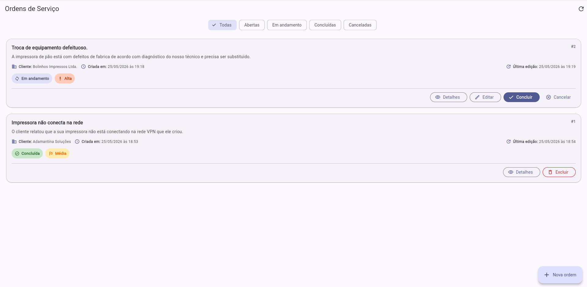
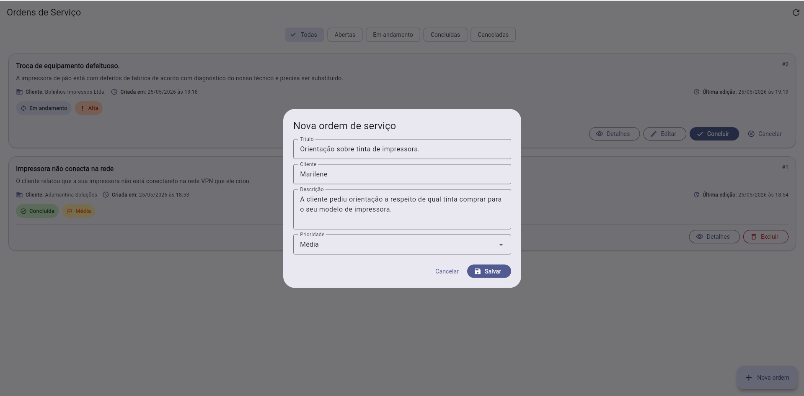
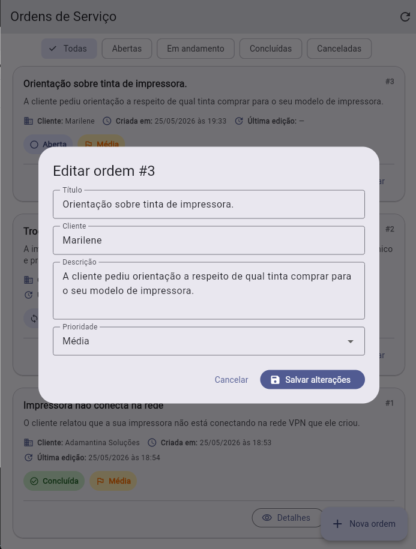
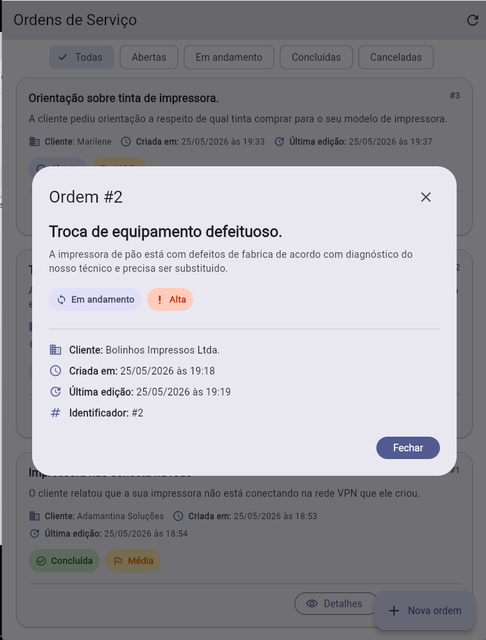
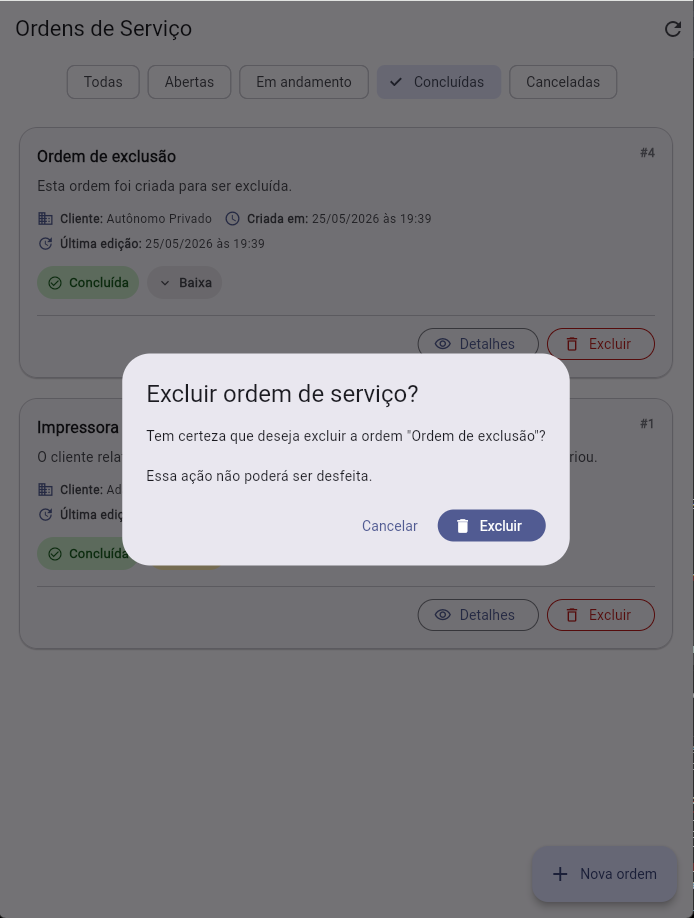
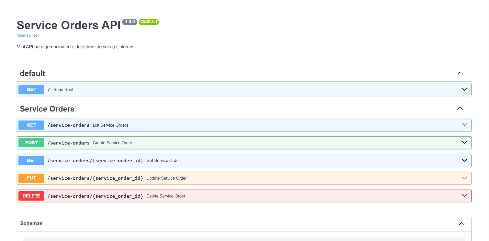

# Service Orders App

Mini projeto de estudo criado para praticar desenvolvimento full stack com Python, FastAPI, SQL e Flutter.

A proposta é simular um sistema corporativo simples de ordens de serviço, com cadastro, listagem, edição, atualização de status e exclusão segura de registros.

O projeto foi criado como estudo direcionado para uma vaga com foco em Flutter, Python, SQL, APIs REST e sistemas corporativos.

## Status atual do projeto

O projeto possui um backend em FastAPI e uma interface em Flutter Web consumindo a API.

### Backend

- API REST com FastAPI
- CRUD de ordens de serviço
- Validação de dados com Pydantic
- Persistência com SQLAlchemy
- Banco SQLite em arquivo para desenvolvimento local
- Registro de data de criação e última edição
- Documentação automática via Swagger/OpenAPI

### Flutter

- Listagem de ordens de serviço
- Filtros por status
- Cadastro de nova ordem
- Edição de ordem existente
- Atualização de status da ordem
- Modal de detalhes
- Exclusão com confirmação
- Consumo de API REST com pacote `http`
- Interface usando Material Design

## Fluxo implementado

O sistema permite criar uma ordem de serviço, acompanhar seu status e realizar ações conforme o estado atual do registro.

- Ordens abertas podem ser iniciadas, editadas ou canceladas.
- Ordens em andamento podem ser concluídas, editadas ou canceladas.
- Ordens concluídas ou canceladas podem ser excluídas com confirmação.
- A API registra a data de criação e a última edição da ordem.
- O app Flutter consome a API REST e atualiza a interface após cada operação.

## Tecnologias usadas

### Backend

- Python
- FastAPI
- SQLAlchemy
- Pydantic
- SQLite
- Swagger/OpenAPI

### Frontend/Mobile

- Flutter
- Dart
- Material Design
- HTTP package

### Ferramentas

- Git
- GitHub
- VS Code

## Estrutura do projeto

```text
service-order-app/
  backend/
    app/
      main.py
      database.py
      models.py
      schemas.py
      routes.py
    requirements.txt

  mobile/
    service_order_mobile/
      lib/
        main.dart
        models/
        services/
        pages/
        widgets/

  docs/
    screenshots/

  README.md
```

## Screenshots

### Flutter Web

Tela principal com listagem, filtros por status, ações condicionais e registro de criação/última edição.



### Fluxos principais

| Criação de ordem | Edição de ordem |
|---|---|
|  |  |

| Detalhes da ordem | Exclusão com confirmação |
|---|---|
|  |  |

### API FastAPI / Swagger

Documentação automática da API com endpoints REST para criação, listagem, busca, atualização e exclusão de ordens de serviço.



## Como rodar o backend

Entre na pasta do backend:

```powershell
cd backend
```

Crie e ative o ambiente virtual:

```powershell
python -m venv .venv
.\.venv\Scripts\Activate.ps1
```

Instale as dependências:

```powershell
pip install -r requirements.txt
```

Execute a API:

```powershell
python -m uvicorn app.main:app --reload
```

Acesse a documentação Swagger:

```text
http://127.0.0.1:8000/docs
```

## Como rodar o Flutter Web

Com o backend rodando, abra outro terminal e entre na pasta do app Flutter:

```powershell
cd mobile/service_order_mobile
```

Execute no Chrome:

```powershell
flutter run -d chrome
```

O app Flutter consome a API local em:

```text
http://127.0.0.1:8000/service-orders
```